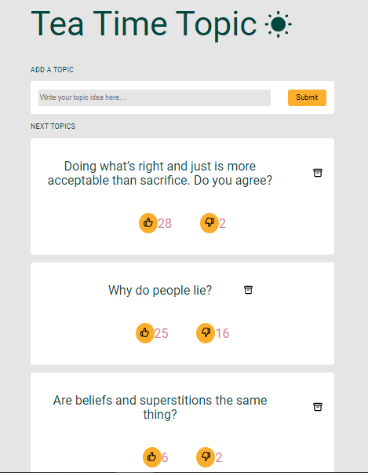

# Tea Time Topic

### Screenshot

### User stories

-  This web app displays a list of topics from [this API url.](https://gist.githubusercontent.com/Pinois/93afbc4a061352a0c70331ca4a16bb99/raw/6da767327041de13693181c2cb09459b0a3657a1/topics.json).
-  The list is separated into two, next and past topics.
-  The next topics are sorted by their upvotes and downvotes rates while the past topics are sorted by the date when they were discussed.
-  Users are able to vote for the ones they like.
-  Users are also able to downvote a topic.
-  Users can add or propose a new topic they want to insert.
-  Users can archive a topic, and once archived the topic goes down to the past topics.
-  Users can remove a topic from the list.

